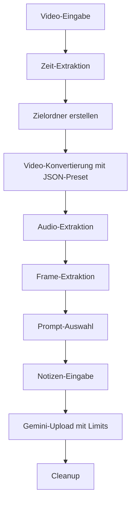

# 🎥 Meeting Video Processor

**Automatische Meeting-Video-Verarbeitung mit Google Gemini AI**

[](https://www.python.org/)
[](https://handbrake.fr/)
[](https://ai.google.dev/gemini)
[](LICENSE)
[](https://12factor.net/)

## 📋 Übersicht

Der **Meeting Video Processor** ist ein leistungsstarkes Python-Tool zur automatischen Verarbeitung von Meeting-Videos und Generierung intelligenter Dokumentation mit Hilfe von Google Gemini AI. Das Tool extrahiert Audio, Frames und erstellt strukturierte Meeting-Zusammenfassungen.

### ✨ Hauptfunktionen

- 🎬 **Intelligente Video-Konvertierung** mit HandBrakeCLI JSON-Presets
- 🎵 **Audio-Extraktion** für Transkription
- 🖼️ **Frame-Extraktion** für visuelle Analyse
- 🤖 **Google Gemini AI Integration** für Meeting-Dokumentation
- ⚙️ **Konfigurierbare Model-Limits** für alle Gemini-Modelle
- 📊 **Strukturierte Logging-Ausgabe** mit sauberen Zeitstempeln
- 🎯 **Flexible Zielverzeichnis-Auswahl** mit `-d/--directory`
- 🔧 **Environment-Variablen Verwaltung** (.env + JSON)
- 🧪 **Dry-Run Modus** für Tests ohne Änderungen
- 🔄 **Robuste Fehlerbehandlung** mit Retry-Logik für 503-Fehler

## 🚀 Schnellstart

### Voraussetzungen

```bash
# macOS (mit Homebrew)
brew install handbrake ffmpeg python@3.12

# Ubuntu/Debian
sudo apt update
sudo apt install handbrake-cli ffmpeg python3 python3-pip
```

### Installation

```bash
# Repository klonen
git clone https://github.com/keeperxy/meeting-video-processor.git
cd meeting-video-processor

# Setup ausführen
./meeting.sh --setup

# Environment-Variablen konfigurieren
cp .env.example .env
# Bearbeite .env und setze deinen Gemini API Key
```

### Erste Schritte

```bash
# Einfache Nutzung
./meeting.sh --video meeting.mp4

# Mit Debug-Informationen
./meeting.sh --video meeting.mp4 --debug

# Dry-Run (Test ohne Änderungen)
./meeting.sh --video meeting.mp4 --dry-run

# Mit spezifischem Zielverzeichnis
./meeting.sh --video meeting.mp4 --directory /path/to/output
```

## 📁 Projektstruktur

```
meeting/
├── meeting_processor.py      # Haupt-Python-Script (903 Zeilen)
├── meeting.sh               # Bash-Wrapper für einfache Nutzung
├── .env                     # Environment-Variablen (nicht in Git)
├── .env.example             # Beispiel-Environment-Variablen
├── model_limits.json        # Gemini Model-Limits Konfiguration
├── requirements.txt          # Python-Dependencies
├── Meeting.json             # HandBrakeCLI JSON-Preset
├── README.md                # Haupt-Dokumentation
├── README_de.md             # Deutsche Dokumentation
├── prompt.txt               # Standard-Prompt Template
├── prompt_wo_transcript.txt # Prompt ohne Transkript
└── prompt_only_transcript.txt # Nur Transkript
```

## ⚙️ Konfiguration

### Environment-Variablen (.env)

Das Tool verwendet Environment-Variablen für die Konfiguration. Kopiere `.env.example` zu `.env` und passe die Werte an:

```bash
# .env
GEMINI_API_KEY=your_actual_api_key_here
FFMPEG_PATH=ffmpeg
HANDBRAKE_PATH=HandBrakeCLI
HANDBRAKE_PRESET_FILE=Meeting.json
HANDBRAKE_PRESET_NAME=Meeting
FRAME_INTERVAL=60
DEFAULT_PROMPT=prompt.txt
GEMINI_MODEL=gemini-2.5-pro
PREFERRED_DATE_SOURCE=metadata
MODEL_LIMITS_FILE=model_limits.json
DEBUG=false
DRY_RUN=false
NO_CLEANUP=false
```


### Wichtige Einstellungen

| Einstellung | Beschreibung | Standard |
|-------------|--------------|----------|
| `frame_interval` | Sekunden zwischen extrahierten Frames | 60 |
| `gemini_model` | Google Gemini Modell | gemini-2.5-pro |
| `handbrake_preset_file` | JSON-Preset-Datei für HandBrakeCLI | Meeting.json |
| `handbrake_preset_name` | Name des Presets in der JSON-Datei | Meeting |
| `PREFERRED_DATE_SOURCE` | Quelle für Datum/Zeit des Target-Ordners (metadata/file_mtime/manual) | metadata |
| `MODEL_LIMITS_FILE` | Datei mit Gemini Model-Limits | model_limits.json |
| `parameter_defaults` | Standard-Parameter für Gemini AI | - |

### Datum/Zeit-Quelle konfigurieren

Die `PREFERRED_DATE_SOURCE` Environment-Variable bestimmt, wie das Datum und die Zeit für den Target-Ordner ermittelt werden:

| Wert | Beschreibung | Verhalten |
|------|--------------|-----------|
| `metadata` | Video-Metadaten | Extrahiert `creation_time` aus Video-Metadaten via ffprobe |
| `file_mtime` | Datei-Modifikationszeit | Verwendet die `st_mtime` der Video-Datei |
| `manual` | Manuelle Eingabe | Fragt den Benutzer nach Datum und Zeit |

**Fallback-Verhalten:** Falls die gewählte Quelle fehlschlägt, wird automatisch zur nächsten Quelle gewechselt:
- `metadata` → `file_mtime` → `manual`
- `file_mtime` → `manual`
- `manual` → Fehler (außer bei Dry-Run)

**Beispiel:**
```bash
# Immer Video-Metadaten verwenden
PREFERRED_DATE_SOURCE=metadata

# Immer Datei-Modifikationszeit verwenden
PREFERRED_DATE_SOURCE=file_mtime

# Immer manuelle Eingabe fordern
PREFERRED_DATE_SOURCE=manual
```

## 🎯 Verarbeitungs-Pipeline



### Detaillierte Schritte

1. **Video-Eingabe** - CLI oder interaktive Auswahl
2. **Zeit-Extraktion** - Konfigurierbar via PREFERRED_DATE_SOURCE (metadata/file_mtime/manual)
3. **Zielordner** - Erstellt mit Zeitstempel (YYYY-MM-DD_HH.MM) oder spezifiziertem Verzeichnis
4. **Video-Konvertierung** - HandBrakeCLI mit JSON-Preset (Meeting.json)
5. **Audio-Extraktion** - ffmpeg M4A Extraktion
6. **Frame-Extraktion** - JPEG-Frames alle 60 Sekunden (optional)
7. **Prompt-Auswahl** - Drei Template-Optionen
8. **Notizen-Eingabe** - Terminal oder Editor
9. **Gemini-Upload** - Multi-Datei Upload an Google AI mit konfigurierbaren Limits und Retry-Logik
10. **Cleanup** - Temporäre Dateien entfernen (Original-Video bleibt erhalten)

## 🛠️ Verwendung

### Bash-Script (empfohlen)

```bash
# Grundlegende Nutzung
./meeting.sh --video meeting.mp4

# Mit verschiedenen Prompt-Templates
./meeting.sh --video meeting.mp4 --prompt prompt_only_transcript.txt
./meeting.sh --video meeting.mp4 --prompt 'only transcript'
./meeting.sh --video meeting.mp4 --prompt 'without transcript'

# Mit spezifischem Zielverzeichnis
./meeting.sh --video meeting.mp4 --directory /path/to/output

# Mit Notizen
./meeting.sh --video meeting.mp4 --notes "Wichtige Punkte: ..."

# Debug-Modus für detaillierte Logs
./meeting.sh --video meeting.mp4 --debug

# Dry-Run für Tests
./meeting.sh --video meeting.mp4 --dry-run

# Ohne Cleanup (temporäre Dateien behalten)
./meeting.sh --video meeting.mp4 --no-cleanup

# Dependencies installieren
./meeting.sh --setup
```

### Python direkt

```bash
# Script ausführen
python3 meeting_processor.py --video meeting.mp4

# Mit allen Optionen
python3 meeting_processor.py \
  --video meeting.mp4 \
  --prompt prompt_only_transcript.txt \
  --notes "Meeting-Notizen" \
  --debug \
  --dry-run
```

## 📊 Prompt-Templates

### prompt.txt (Standard)
Vollständige Analyse mit Transkript, visueller Frame-Analyse, Zusammenfassung und Aktionspunkten.

### prompt_wo_transcript.txt
Analyse ohne detailliertes Transkript, nur visuelle Frame-Analyse.

### prompt_only_transcript.txt
Nur Transkript-Generierung, keine Frame-Extraktion.

## 🔧 HandBrakeCLI JSON-Preset

Das Tool verwendet ein zentrales JSON-Preset für alle Video-Konvertierungen:

```json
{
  "PresetList": [
    {
      "PresetName": "Meeting",
      "VideoEncoder": "vt_h265",
      "VideoQualitySlider": 15,
      "VideoFramerate": "10",
      "AudioEncoder": "ca_aac",
      "AudioBitrate": 64,
      "FileFormat": "av_mp4"
    }
  ]
}
```

**Vorteile:**
- Zentrale Konfiguration aller Video-Einstellungen
- Einfache Anpassung ohne Code-Änderungen
- Konsistente Qualität für alle Konvertierungen

## 🤖 Google Gemini AI Integration

### Model-Limits Konfiguration

Die Model-Limits werden in einer separaten `model_limits.json` Datei konfiguriert:

```json
{
  "gemini-2.5-pro": {
    "max_input_tokens": 1048576,
    "max_output_tokens": 65535,
    "max_images_per_prompt": 3000,
    "max_image_size_mb": 7,
    "max_audio_length_hours": 8.4,
    "max_audio_files_per_prompt": 1,
    "parameter_defaults": {
      "temperature": 0.3,
      "top_p": 0.95,
      "top_k": 64,
      "candidate_count": 1
    }
  }
}
```

**Vorteile der separaten Datei:**
- **Bessere Wartbarkeit:** Komplexe Konfigurationen in strukturierter JSON-Datei
- **Flexibilität:** Einfache Anpassung ohne Code-Änderungen
- **Übersichtlichkeit:** Klare Trennung von Environment-Variablen und Model-Konfiguration
- **Versionierung:** Model-Limits können unabhängig versioniert werden

### Unterstützte Modelle

| Modell | Input Tokens | Output Tokens | Bilder | Audio |
|--------|--------------|---------------|--------|-------|
| gemini-2.5-pro | 1,048,576 | 65,535 | 3,000 | 8.4h |
| gemini-2.5-flash | 1,048,576 | 65,535 | 3,000 | 8.4h |
| gemini-2.0-flash | 1,048,576 | 8,192 | 3,000 | 8.4h |

### Parameter-Defaults

```json
{
  "temperature": 0.3,
  "top_p": 0.95,
  "top_k": 64,
  "candidate_count": 1
}
```

### Automatische Validierung

Das Tool validiert automatisch alle Parameter und warnt bei ungültigen Werten:

```
Warning: temperature 2.5 is outside valid range [0.0-2.0], clamping to 2.0
```

### Fehlerbehandlung und Retry-Logik

Das Tool implementiert eine robuste Fehlerbehandlung für 503 UNAVAILABLE Fehler von Google Gemini:

#### Retry-Mechanismus
- **Automatische Wiederholung:** Bei 503-Fehlern wird automatisch bis zu 5x wiederholt
- **Exponentieller Backoff:** Wartezeiten zwischen 1, 2, 4, 8 und 16 Minuten
- **Intelligente Erkennung:** Erkennt 503-Fehler in verschiedenen Error-Formaten

#### Fehlerbehandlung
- **Original-Datei erhalten:** Das ursprüngliche Video bleibt unverändert
- **Automatische Bereinigung:** Bei Fehlern werden erstellte Dateien und Ordner entfernt
- **Detailliertes Logging:** Alle Retry-Versuche werden protokolliert

#### Beispiel-Logging
```
2025-07-23 11:05:58 - WARNING - 503 UNAVAILABLE error (attempt 1/6). Retrying in 60 seconds...
2025-07-23 11:06:58 - WARNING - 503 UNAVAILABLE error (attempt 2/6). Retrying in 120 seconds...
2025-07-23 11:08:58 - WARNING - 503 UNAVAILABLE error (attempt 3/6). Retrying in 240 seconds...
2025-07-23 11:12:58 - ERROR - All 6 attempts failed with 503 UNAVAILABLE error
2025-07-23 11:12:58 - INFO - Cleaning up created files due to failure...
```

#### Nicht-Retrybare Fehler
- Andere HTTP-Fehler (4xx, 5xx außer 503)
- Netzwerk-Fehler
- Authentifizierungs-Fehler
- Token-Limit-Überschreitungen

## 📝 Logging und Debugging

### Logging-Format

```
2025-07-20 14:12:12 - INFO - Starting processing of video: meeting.mp4
2025-07-20 14:12:12 - INFO - Using model limits for gemini-2.5-pro:
2025-07-20 14:12:12 - INFO -   • max_input_tokens: 1048576
2025-07-20 14:12:12 - INFO -   • max_output_tokens: 65535
2025-07-20 14:12:12 - INFO - Using parameter defaults:
2025-07-20 14:12:12 - INFO -   • temperature: 0.3
2025-07-20 14:12:12 - INFO -   • top_p: 0.95
```

### Debug-Modus aktivieren

```bash
# Bash-Script
./meeting.sh --video meeting.mp4 --debug

# Python direkt
python3 meeting_processor.py --video meeting.mp4 --debug
```

### Log-Dateien

- **Console:** Echtzeit-Ausgabe mit sauberen Zeitstempeln
- **File:** `process.log` im Zielordner (wird automatisch erstellt)
- **Format:** `2025-07-20 14:12:12 - INFO - ...`

## 🔍 Troubleshooting

### Häufige Probleme

| Problem | Lösung |
|---------|--------|
| **HandBrakeCLI nicht gefunden** | `brew install handbrake` |
| **ffmpeg nicht gefunden** | `brew install ffmpeg` |
| **Gemini API Key fehlt** | In `.env` setzen |
| **Virtual Environment Probleme** | `./meeting.sh --setup` |
| **HandBrake Preset nicht gefunden** | Meeting.json im Script-Verzeichnis prüfen |
| **Model-Limits Fehler** | model_limits.json Syntax validieren |

### Fehlerbehebung

```bash
# Dependencies prüfen
./meeting.sh --setup

# Debug-Modus für detaillierte Logs
./meeting.sh --video meeting.mp4 --debug

# Dry-Run für Tests ohne Änderungen
./meeting.sh --video meeting.mp4 --dry-run

# Ohne Cleanup für Inspektion
./meeting.sh --video meeting.mp4 --no-cleanup
```

## 🚀 Performance

### Video-Konvertierung
- JSON-Preset-basiert (Meeting.json)
- H.265 Codec für gute Kompression
- Qualität 15 (hoch)
- Variable Frame Rate (10 fps)
- HTTP Streaming optimiert

### Memory-Management
- Streaming-Modus für große Dateien
- Automatisches Cleanup temporärer Dateien
- Optimierte Frame-Extraktion

## 🔒 Sicherheit

### API Key Management
- API Keys nur in `.env` (nicht in Git)
- `.env.example` ohne echte Keys
- Sichere API Key Verwaltung in .env

### Datei-Berechtigungen
- Sichere temporäre Datei-Erstellung
- Automatisches Cleanup nach Verarbeitung
- Validierung aller Eingabe-Pfade

## 🧪 Testing

### Dry-Run Modus
```bash
./meeting.sh --video meeting.mp4 --dry-run
```
Simuliert die komplette Verarbeitung ohne Änderungen zu machen.

### Unit Tests
```bash
# Python-Tests (falls implementiert)
python3 -m pytest tests/

# Integration Tests
./meeting.sh --video test_video.mp4 --dry-run --debug
```

## 📈 Roadmap

### Geplante Features
- [ ] **Batch-Verarbeitung** mehrerer Videos
- [ ] **Web-Interface** für einfache Bedienung
- [ ] **Docker-Container** für einfache Deployment
- [ ] **CI/CD Integration** für automatisierte Tests
- [ ] **Mehrsprachige Unterstützung** für Transkripte
- [ ] **Cloud-Integration** (AWS, GCP, Azure)

### Verbesserungen
- [ ] **Performance-Optimierung** für große Videos
- [ ] **Erweiterte Prompt-Templates**
- [ ] **Custom Model-Limits** pro Umgebung
- [ ] **Webhook-Integration** für Benachrichtigungen

## 🤝 Contributing

### Entwicklungsumgebung einrichten

```bash
# Repository klonen
git clone https://github.com/keeperxy/meeting-video-processor.git
cd meeting-video-processor

# Dependencies installieren
./meeting.sh --setup

# Environment konfigurieren
cp .env.example .env
# Bearbeite .env mit deinen API Keys
```

### Code-Standards

- **Python:** PEP 8, Type Hints, Docstrings
- **Bash:** ShellCheck-konform
- **JSON:** Validierte Syntax
- **Tests:** Unit Tests für neue Features

### Pull Request Workflow

1. **Feature Branch erstellen**
   ```bash
   git checkout -b feature/neue-funktion
   ```

2. **Änderungen implementieren**
   - Code schreiben
   - Tests hinzufügen
   - Dokumentation aktualisieren

3. **Tests ausführen**
   ```bash
   ./meeting.sh --video test.mp4 --dry-run --debug
   ```

4. **Pull Request erstellen**
   - Beschreibung der Änderungen
   - Screenshots (falls relevant)
   - Test-Ergebnisse

## 📄 License

Dieses Projekt steht unter der MIT License. Siehe [LICENSE](LICENSE) für Details.

## 🙏 Acknowledgments

- **Google Gemini AI** für die leistungsstarke KI-Integration
- **HandBrake** für die Video-Konvertierung
- **FFmpeg** für Audio- und Frame-Extraktion
- **Python Community** für die großartigen Libraries

## 📞 Support

### Hilfe bekommen

- **Issues:** [GitHub Issues](https://github.com/keeperxy/meeting-video-processor/issues)

### Community

- **Beitragen:** Pull Requests sind willkommen!
- **Feedback:** Issues und Feature Requests
- **Sharing:** Sterne und Forks sind sehr geschätzt

---

**Entwickelt mit ❤️ für die Meeting-Dokumentation der Zukunft**

[](https://github.com/keeperxy/meeting-video-processor)
[](https://github.com/keeperxy/meeting-video-processor)
[](https://github.com/keeperxy/meeting-video-processor/issues) 